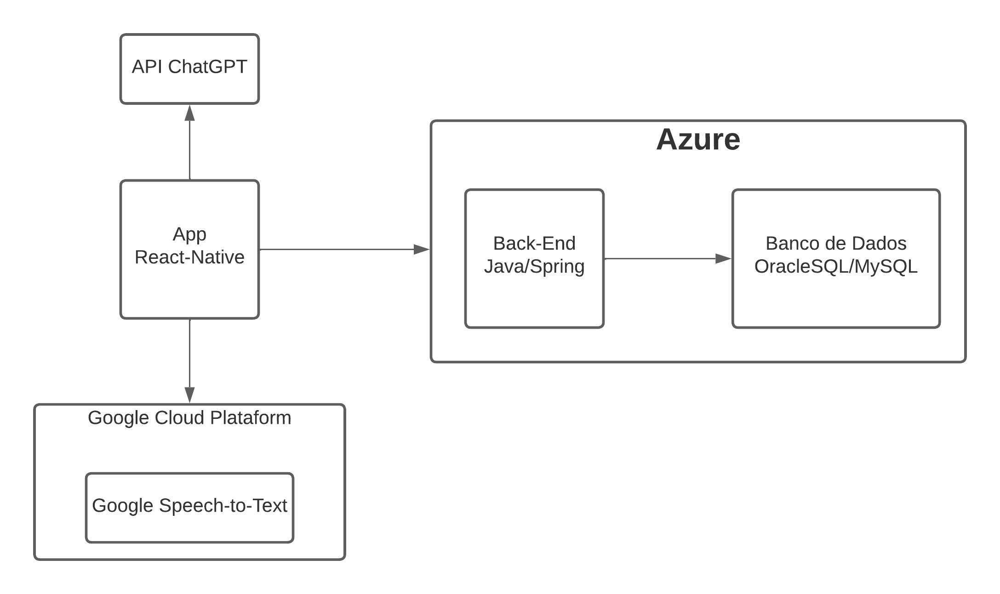

<h1>API GLOBAL NextIdea - FIAP</h1>

<h2>Video<h2>
<a>https://www.youtube.com/watch?v=oJYX6Xz1k3A  DBE</a>
<a>https://www.youtube.com/watch?v=HVARhIIDw3I Enterprise</a>

<h2>Para Instalar e executar</h2>
<code>git clone https://github.com/HigorA/api_global.git </code><br/>
<code>cd api_global</code><br/>
<code>./gradlew bootRun</code><br/>
<p>Ou com o docker</p>
<code>git clone https://github.com/HigorA/global-devops.git</code><br/>
<code>cd global-devops</code><br/>
<code>docker-compose up -d --build</code>

<p><b>ATENÇÂO: VERIFIQUE O ARQUIVO application.properties, dependendo da sua escolha, é necessário alterar os parametros de conexão!</b></p>

<h2>Para Usar</h2>
<p>Caso deseje testar a aplicação, é necessaŕio criar um novo usuário no endpoint:</p>
<code>
    /auth/signup
</code>
<p>com o seguinte corpo, o login tem que estar no padrão de email</p>


```json
  {
    "login": "string@string.com",
    "password": "string"
  }
```

<h2>Diagrama de Classe</h2>


<h2>Componentes</h2>
<p>Arquitetura</p>
<ul>
    <li>Uma API back-end escrita em Java, resposável pela autenticação e operações do 
        usuário, tais como: login, cadastro, desativar conta,
        adicionar favorito, editar favorito e remover favorito
    </li>
    <li>Um banco de dados relacional, OracleSQL/MySQL, para armazenar
        os dados de persistêcia do usuário, tais como conta e favoritos.
    </li>
    <li>Uma interface front-end que irá consumir a API e ao mesmo 
        tempo consumir a API do chatGPT para realizar as pesquisas.
        Este front-end será um aplicativo mobile construido em 
        react-native e contará com a funcionalidade de STT (Speech-to-Text)
        e TTS (Text-to-Speech).
    </li>
</ul>


<h2>Arquitetura da Solução - Macro</h2>



<h3>Tecnologias</h3>
<ul>
    <li>Java | Spring Framework</li>
    <li>React Native</li>
    <li>Expo</li>
    <li>Google Cloud Plataform | Google Speech to Text API</li>
    <li>Banco de Dados Oracle | MySQL</li>
    <li>Azure</li>
    <li>API ChatGPT</li>
</ul>

<h2>Endpoints</h2>
<ul>
    <ul>
        <h3>Ong</h3>
        <li>GET : /ong/{userId}</li>
        <li>POST : /ong/{userId}</li>
        <li>GET : /ong/{userId}</li>
    </ul>
    <ul>
        <h3>Autenticação</h3>
        <li>POST : /auth/signup</li>
        <li>POST : /auth/signin</li>
        <li>DELETE : /auth/delete</li>
    </ul>    
       <ul>
        <h3>Unidade</h3>
        <li>GET : /unidade/{ongId}</li>
        <li>POST : /unidade/{ongId}</li>
        <li>GET : /unidade/id/{unidadeId}</li>
    </ul>    
</ul>

<h2>Corpo de requisição para endpoint</h2>


<h4>GET : /ong/{userId}</h4>
<p>Apenas o id na URL</p>

<h4>POST : /ong/{userId}</h4>

```json
  {
    "razaoSocial": "string"
  }
```


<h4>POST : /auth/signup</h4>

```json
  {
    "login": "string@string.com",
    "password": "string"
  }
```

<h4>POST : /auth/signin</h4>

```json
  {
    "login": "string@string.com",
    "password": "string"
  }
```


<h4>DELETE : /auth/delete</h4>

```json
  {
    "login": "string@string.com",
    "password": "string"
  }
```


<h4>GET : /unidade/{ongId}</h4>

```json
  {
  "page": 0,
  "size": 1,
  "sort": [
    "string"
  ]
}
```


<h4>POST : /unidade/{ongId}</h4>

```json
{
  "enderecoVO": {
    "cep": 0,
    "uf": "string",
    "bairro": "string",
    "logradouro": "string",
    "numero": "string",
    "complemento": "string"
  },
  "status": "string",
  "horarioDeFuncionamento": "string",
  "contatoVO": [
    {
      "telefone": "string"
    }
  ]
}
```

<h4>GET : /unidade/id/{unidadeId}</h4>
<p>Sem corpo.</p>